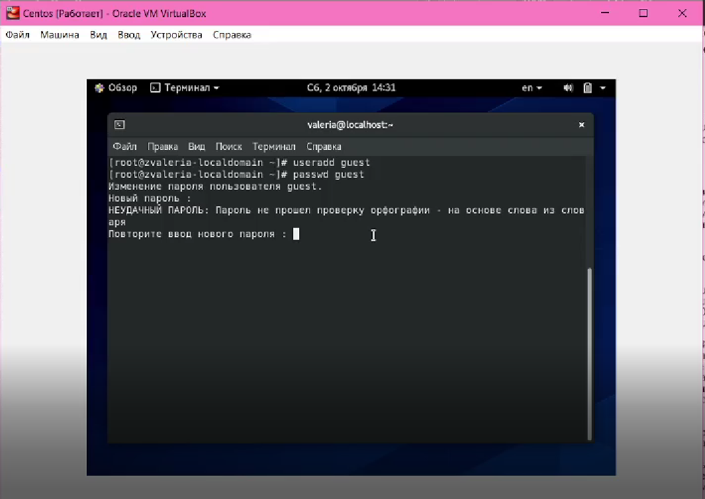
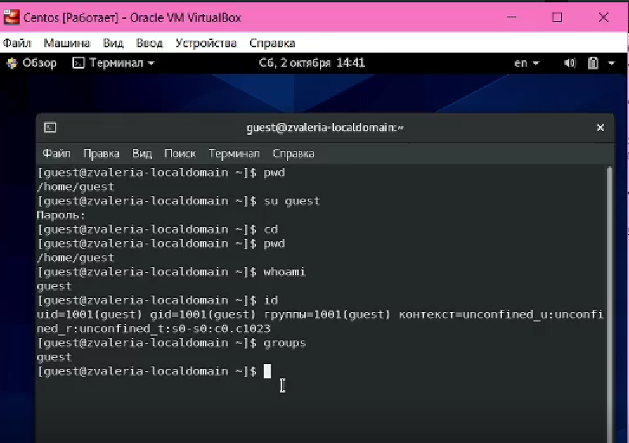

---
## Front matter
lang: ru-RU
title: Дискреционное разграничение прав в Linux. Основные атрибуты.
author: |
	 Жижченко Валерия Викторовна

institute: Российский Университет Дружбы Народов

## Formatting
mainfont: PT Serif
romanfont: PT Serif
sansfont: PT Sans
monofont: PT Mono
toc: false
slide_level: 2
theme: metropolis
header-includes: 
 - \metroset{progressbar=frametitle,sectionpage=progressbar,numbering=fraction}
 - '\makeatletter'
 - '\beamer@ignorenonframefalse'
 - '\makeatother'
aspectratio: 43
section-titles: true

---

# Цель лабораторной работы

Получить практические навыки работы в консоли с атрибутами файлов, закрепление теоретических основ дискреционного разграничения доступа в современных системах с открытым кодом на базе ОС Linux.

# Процесс выполнения лабораторной работы

1. Создаем учётную запись пользователя guest:

```
$ useradd guest
```

2. Задаем пароль для пользователя guest:

```
$ passwd guest
```

3. Входим в систему от имени пользователя guest.

```
$ su guest
```
## Процесс выполнения лабораторной работы

{ #fig:001 width=70% }

## Процесс выполнения лабораторной работы

4. Определяем директорию, в которой мы находимся. Сравниваем её с приглашением командной строки. Определяем, является ли она домашней директорией? Если нет, заходим в домашнюю директорию.

```
$ pwd
$ cd
```

5. Уточняем имя пользователя.

```
$ whoami
```

## Процесс выполнения лабораторной работы

6. Уточнем имя пользователя, его группу, а также группы, куда входит пользователь. Сравните вывод ```id``` с выводом команды ```groups```.

```
$ id
$ groups
```
## Процесс выполнения лабораторной работы

{ #fig:002 width=70% }


## Процесс выполнения лабораторной работы

7. Сравниваем полученную информацию об имени пользователя с данными, выводимыми в приглашении командной строки.

8. Просмотрим файл ```/etc/passwd```.

```
$ cat /etc/passwd | grep guest
```

## Процесс выполнения лабораторной работы

{ #fig:003 width=70% }

## Процесс выполнения лабораторной работы

9. Определите существующие в системе директории.

```
$ ls -l /home/
```

10. Проверяем, какие расширенные атрибуты установлены на поддиректориях, находящихся в директории /home.

```
$ lsattr /home
```

## Процесс выполнения лабораторной работы

11. Создаем в домашней директории поддиректорию dir1 и определяем, какие права доступа и расширенные атрибуты были выставлены на директорию dir1.

```
$ mkdir dir1
$ ls -l
$ lsattr
```
## Процесс выполнения лабораторной работы

{ #fig:004 width=70% }


## Процесс выполнения лабораторной работы

12. Снимаем с директории dir1 все атрибуты и проверяем правильность выполнения команды.

```
$ chmod 000 dir1/
$ ls -l
```

## Процесс выполнения лабораторной работы

13. Пытаемся создать в директории dir1 файл file1 и проверяем результат.

```
echo test > /home/guest/dir1/file1
ls -l /home/guest/dir1
```

## Процесс выполнения лабораторной работы

{ #fig:05 width=70% }

# Вывод

Получили практические навыки работы в консоли с атрибутами файлов, закреплили теоретические основы дискреционного разграничения доступа в современных системах с открытым кодом на базе ОС Linux.
