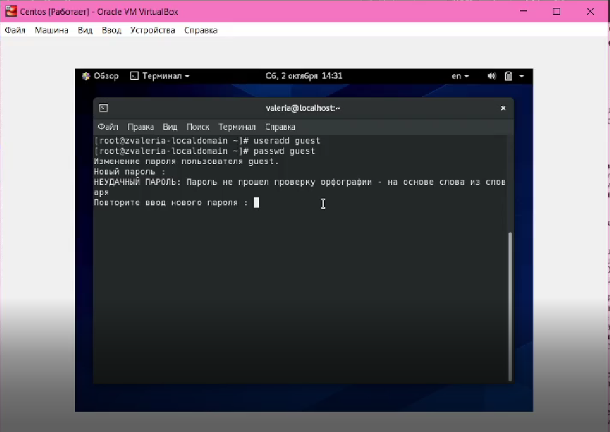
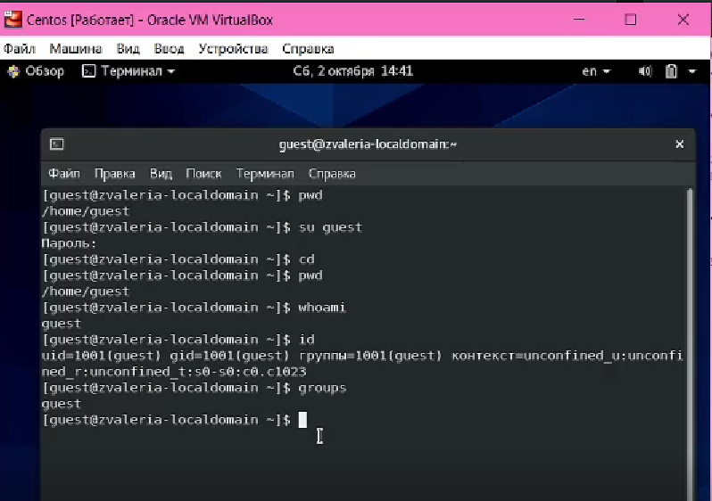
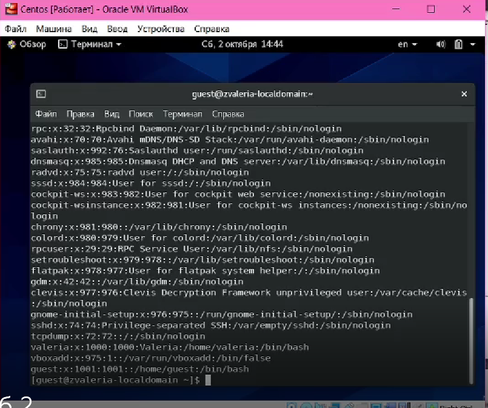
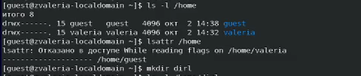

---
# Front matter
lang: ru-RU
title: "Отчёт по лабораторной работе №2"
subtitle: "Дискреционное разграничение прав в Linux. Основные атрибуты."
author: "Жижченко Валерия Викторовна"

# Formatting
toc-title: "Содержание"
toc: true # Table of contents
toc_depth: 2
lof: true # List of figures
fontsize: 12pt
linestretch: 1.5
papersize: a4paper
documentclass: scrreprt
polyglossia-lang: russian
polyglossia-otherlangs: english
mainfont: PT Serif
romanfont: PT Serif
sansfont: PT Sans
monofont: PT Mono
mainfontoptions: Ligatures=TeX
romanfontoptions: Ligatures=TeX
sansfontoptions: Ligatures=TeX,Scale=MatchLowercase
monofontoptions: Scale=MatchLowercase
indent: true
pdf-engine: lualatex
header-includes:
  - \linepenalty=10 # the penalty added to the badness of each line within a paragraph (no associated penalty node) Increasing the value makes tex try to have fewer lines in the paragraph.
  - \interlinepenalty=0 # value of the penalty (node) added after each line of a paragraph.
  - \hyphenpenalty=50 # the penalty for line breaking at an automatically inserted hyphen
  - \exhyphenpenalty=50 # the penalty for line breaking at an explicit hyphen
  - \binoppenalty=700 # the penalty for breaking a line at a binary operator
  - \relpenalty=500 # the penalty for breaking a line at a relation
  - \clubpenalty=150 # extra penalty for breaking after first line of a paragraph
  - \widowpenalty=150 # extra penalty for breaking before last line of a paragraph
  - \displaywidowpenalty=50 # extra penalty for breaking before last line before a display math
  - \brokenpenalty=100 # extra penalty for page breaking after a hyphenated line
  - \predisplaypenalty=10000 # penalty for breaking before a display
  - \postdisplaypenalty=0 # penalty for breaking after a display
  - \floatingpenalty = 20000 # penalty for splitting an insertion (can only be split footnote in standard LaTeX)
  - \raggedbottom # or \flushbottom
  - \usepackage{float} # keep figures where there are in the text
  - \floatplacement{figure}{H} # keep figures where there are in the text
---

# Цель работы

Получить практические навыки работы в консоли с атрибутами файлов, закрепление теоретических основ дискреционного разграничения доступа в современных системах с открытым кодом на базе ОС Linux.

# Выполнение лабораторной работы

1. Создаем учётную запись пользователя guest:

```
$ useradd guest
```

2. Задаем пароль для пользователя guest:

```
$ passwd guest
```

3. Входим в систему от имени пользователя guest.

```
$ su guest
```
{ #fig:001 width=70% }

4. Определяем директорию, в которой мы находимся. Сравниваем её с приглашением командной строки. Определяем, является ли она домашней директорией? Если нет, заходим в домашнюю директорию.

```
$ pwd
$ cd
```

5. Уточняем имя пользователя.

```
$ whoami
```

6. Уточнем имя пользователя, его группу, а также группы, куда входит пользователь. Сравните вывод ```id``` с выводом команды ```groups```.

```
$ id
$ groups
```
{ #fig:002 width=70% }

7. Сравниваем полученную информацию об имени пользователя с данными, выводимыми в приглашении командной строки.

8. Просмотрим файл ```/etc/passwd```.

```
$ cat /etc/passwd | grep guest
```

{ #fig:003 width=70% }

9. Определите существующие в системе директории.

```
$ ls -l /home/
```

10. Проверяем, какие расширенные атрибуты установлены на поддиректориях, находящихся в директории /home.

```
$ lsattr /home
```

11. Создаем в домашней директории поддиректорию dir1 и определяем, какие права доступа и расширенные атрибуты были выставлены на директорию dir1.

```
$ mkdir dir1
$ ls -l
$ lsattr
```
{ #fig:004 width=70% }

12. Снимаем с директории dir1 все атрибуты и проверяем правильность выполнения команды.

```
$ chmod 000 dir1/
$ ls -l
```

13. Пытаемся создать в директории dir1 файл file1 и проверяем результат.

```
echo test > /home/guest/dir1/file1
ls -l /home/guest/dir1
```

{ #fig:05 width=70% }

14. Заполянем таблицу "Установленные права и разрешённые действия".

| Права директории | Права файла | Создание файла | Удаление файла | Запись в файл | Чтение файла | Смена директории | Просмотр файлов в директории | Переименование Файла | Смена атрибутов файла |
|:----------------:|:-----------:|:--------------:|:--------------:|:-------------:|:------------:|:----------------:|:----------------------------:|:--------------------:|:---------------------:|
| - - - (000)      | - - - (000) |        -       |        -       |       -       |       -      |        -         |              -               |          -           |           -           |
| - - x (100)      | - - - (000) |        -       |        -       |       -       |       -      |        +         |              -               |          -           |           +           |
| - w - (200)      | - - - (000) |        -       |        -       |       -       |       -      |        -         |              -               |          -           |           -           |
| - w x (300)      | - - - (000) |        +       |        +       |       -       |       -      |        +         |              -               |          +           |           +           |
| r - - (400)      | - - - (000) |        -       |        -       |       -       |       -      |        -         |              +               |          -           |           -           |
| r - x (500)      | - - - (000) |        -       |        -       |       -       |       -      |        +         |              +               |          -           |           +           |
| r w - (600)      | - - - (000) |        -       |        -       |       -       |       -      |        -         |              +               |          -           |           -           |
| r w x (700)      | - - - (000) |        +       |        +       |       -       |       -      |        +         |              +               |          +           |           +           |
| - - - (000)      | - - x (100) |        -       |        -       |       -       |       -      |        -         |              -               |          -           |           -           |
| - - x (100)      | - - x (100) |        -       |        -       |       -       |       -      |        +         |              -               |          -           |           +           |
| - w - (200)      | - - x (100) |        -       |        -       |       -       |       -      |        -         |              -               |          -           |           -           |
| - w x (300)      | - - x (100) |        +       |        +       |       -       |       -      |        +         |              -               |          +           |           +           |
| r - - (400)      | - - x (100) |        -       |        -       |       -       |       -      |        -         |              +               |          -           |           -           |
| r - x (500)      | - - x (100) |        -       |        -       |       -       |       -      |        +         |              +               |          -           |           +           |
| r w - (600)      | - - x (100) |        -       |        -       |       -       |       -      |        -         |              +               |          -           |           -           |
| r w x (700)      | - - x (100) |        +       |        +       |       -       |       -      |        +         |              +               |          +           |           +           |
| - - - (000)      | - w - (200) |        -       |        -       |       -       |       -      |        -         |              -               |          -           |           -           |
| - - x (100)      | - w - (200) |        -       |        -       |       +       |       -      |        +         |              -               |          -           |           +           |
| - w - (200)      | - w - (200) |        -       |        -       |       -       |       -      |        -         |              -               |          -           |           -           |
| - w x (300)      | - w - (200) |        +       |        +       |       +       |       -      |        +         |              -               |          +           |           +           |
| r - - (400)      | - w - (200) |        -       |        -       |       -       |       -      |        -         |              +               |          -           |           -           |
| r - x (500)      | - w - (200) |        -       |        -       |       +       |       -      |        +         |              +               |          -           |           +           |
| r w - (600)      | - w - (200) |        -       |        -       |       -       |       -      |        -         |              +               |          -           |           -           |
| r w x (700)      | - w - (200) |        +       |        +       |       +       |       -      |        +         |              +               |          +           |           +           |
| - - - (000)      | - w x (300) |        -       |        -       |       -       |       -      |        -         |              -               |          -           |           -           |
| - - x (100)      | - w x (300) |        -       |        -       |       +       |       -      |        +         |              -               |          -           |           +           |
| - w - (200)      | - w x (300) |        -       |        -       |       -       |       -      |        -         |              -               |          -           |           -           |
| - w x (300)      | - w x (300) |        +       |        +       |       +       |       -      |        +         |              -               |          +           |           +           |
| r - - (400)      | - w x (300) |        -       |        -       |       -       |       -      |        -         |              +               |          -           |           -           |
| r - x (500)      | - w x (300) |        -       |        -       |       +       |       -      |        +         |              +               |          -           |           +           |
| r w - (600)      | - w x (300) |        -       |        -       |       -       |       -      |        -         |              +               |          -           |           -           |
| r w x (700)      | - w x (300) |        +       |        +       |       +       |       -      |        +         |              +               |          +           |           +           |
| - - - (000)      | r - - (400) |        -       |        -       |       -       |       -      |        -         |              -               |          -           |           -           |
| - - x (100)      | r - - (400) |        -       |        -       |       -       |       +      |        +         |              -               |          -           |           +           |
| - w - (200)      | r - - (400) |        -       |        -       |       -       |       -      |        -         |              -               |          -           |           -           |
| - w x (300)      | r - - (400) |        +       |        +       |       -       |       +      |        +         |              -               |          +           |           +           |
| r - - (400)      | r - - (400) |        -       |        -       |       -       |       -      |        -         |              +               |          -           |           -           |
| r - x (500)      | r - - (400) |        -       |        -       |       -       |       +      |        +         |              +               |          -           |           +           |
| r w - (600)      | r - - (400) |        -       |        -       |       -       |       -      |        -         |              +               |          -           |           -           |
| r w x (700)      | r - - (400) |        +       |        +       |       -       |       +      |        +         |              +               |          +           |           +           |
| - - - (000)      | r - x (500) |        -       |        -       |       -       |       -      |        -         |              -               |          -           |           -           |
| - - x (100)      | r - x (500) |        -       |        -       |       -       |       +      |        +         |              -               |          -           |           +           |
| - w - (200)      | r - x (500) |        -       |        -       |       -       |       -      |        -         |              -               |          -           |           -           |
| - w x (300)      | r - x (500) |        +       |        +       |       -       |       +      |        +         |              -               |          +           |           +           |
| r - - (400)      | r - x (500) |        -       |        -       |       -       |       -      |        -         |              +               |          -           |           -           |
| r - x (500)      | r - x (500) |        -       |        -       |       -       |       +      |        +         |              +               |          -           |           +           |
| r w - (600)      | r - x (500) |        -       |        -       |       -       |       -      |        -         |              +               |          -           |           -           |
| r w x (700)      | r - x (500) |        +       |        +       |       -       |       +      |        +         |              +               |          +           |           +           |
| - - - (000)      | r w x (600) |        -       |        -       |       -       |       -      |        -         |              -               |          -           |           -           |
| - - x (100)      | r w x (600) |        -       |        -       |       +       |       +      |        +         |              -               |          -           |           +           |
| - w - (200)      | r w x (600) |        -       |        -       |       -       |       -      |        -         |              -               |          -           |           -           |
| - w x (300)      | r w x (600) |        +       |        +       |       +       |       +      |        +         |              -               |          +           |           +           |
| r - - (400)      | r w x (600) |        -       |        -       |       -       |       -      |        -         |              +               |          -           |           -           |
| r - x (500)      | r w x (600) |        -       |        -       |       +       |       +      |        +         |              +               |          -           |           +           |
| r w - (600)      | r w x (600) |        -       |        -       |       -       |       -      |        -         |              +               |          -           |           -           |
| r w x (700)      | r w x (600) |        +       |        +       |       +       |       +      |        +         |              +               |          +           |           +           |
| - - - (000)      | r w x (700) |        -       |        -       |       -       |       -      |        -         |              -               |          -           |           -           |
| - - x (100)      | r w x (700) |        -       |        -       |       +       |       +      |        +         |              -               |          -           |           +           |
| - w - (200)      | r w x (700) |        -       |        -       |       -       |       -      |        -         |              -               |          -           |           -           |
| - w x (300)      | r w x (700) |        +       |        +       |       +       |       +      |        +         |              -               |          +           |           +           |
| r - - (400)      | r w x (700) |        -       |        -       |       -       |       -      |        -         |              +               |          -           |           -           |
| r - x (500)      | r w x (700) |        -       |        -       |       +       |       +      |        +         |              +               |          -           |           +           |
| r w - (600)      | r w x (700) |        -       |        -       |       -       |       -      |        -         |              +               |          -           |           -           |
| r w x (700)      | r w x (700) |        +       |        +       |       +       |       +      |        +         |              +               |          +           |           +           |

15. Заполняем таблицу "Минимальные права для совершения операций".

|Операция              |Минимальные права на директорию|Минимальные права на файл|
|:--------------------:|:-----------------------------:|:-----------------------:|
|Создание файла        |         - w x (300)           |      - - - (000)        |
|Удаление файла        |         - w x (300)           |      - - - (000)        |
|Чтение файла          |         - - x (100)           |      r - - (400)        |
|Запись в файл         |         - - x (100)           |      - w - (200)        |
|Переименование файла  |         - w x (300)           |      - - - (000)        |
|Создание поддиректории|         - w x (300)           |      - - - (000)        |
|Удаление поддиректории|         - w x (300)           |      - - - (000)        |

# Вывод

Получили практические навыки работы в консоли с атрибутами файлов, закреплили теоретические основы дискреционного разграничения доступа в современных системах с открытым кодом на базе ОС Linux.

