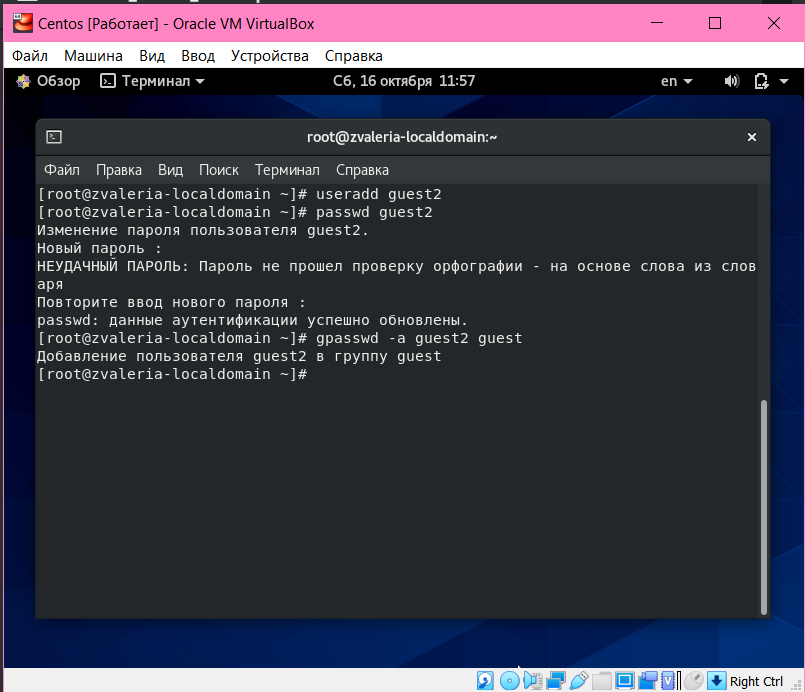

---
## Front matter
lang: ru-RU
title: Дискреционное разграничение прав в Linux. Основные атрибуты
author: |
	 Жижченко Валерия Викторовна НФИбд-03-18\inst{1}

institute: |
	\inst{1}Российский Университет Дружбы Народов

date: 16 октября, 2021, Москва, Россия

## Formatting
mainfont: PT Serif
romanfont: PT Serif
sansfont: PT Sans
monofont: PT Mono
toc: false
slide_level: 2
theme: metropolis
header-includes: 
 - \metroset{progressbar=frametitle,sectionpage=progressbar,numbering=fraction}
 - '\makeatletter'
 - '\beamer@ignorenonframefalse'
 - '\makeatother'
aspectratio: 43
section-titles: true

---

# Цели и задачи работы

## Цель лабораторной работы

Получение практических навыков работы в консоли с атрибутами файлов для групп пользователей.

# Процесс выполнения лабораторной работы

1. Создаю пользователя guest2.

```
$ useradd guest2
```

2. Задаем пароль для пользователя guest2:

```
$ passwd guest
```

3. Добавляю guest2 в группу guest

```
$ gpasswd -a guest2 guest
```
 
## Процесс выполнения лабораторной работы

{ #fig:001 width=70% }

## Процесс выполнения лабораторной работы

4. Входим в систему от имени пользователя guest и guest2.

```
$ su guest / $ su guest2
```

5. Определяем директорию, в которой мы находитесь

```
$ pwd
```

6. Определяем какие группы входят пользователи guest и guest2
```
$ groups guest / $ groups guest2
```

7. Входим команды для сравнения

```
$ id -Gn / $ id -G
```
## Процесс выполнения лабораторной работы

{ #fig:002 width=70% }

## Процесс выполнения лабораторной работы

{ #fig:003 width=70% }

## Процесс выполнения лабораторной работы

8. Просмотрим файл командой

```
$ cat /etc/group
```
## Процесс выполнения лабораторной работы

{ #fig:004 width=70% }

## Процесс выполнения лабораторной работы

9. От имени пользователя guest2 выполним регистрацию пользователя
guest2 в группе guest 

```
$ newgrp guest
```
## Процесс выполнения лабораторной работы

{ #fig:005 width=70% }

## Процесс выполнения лабораторной работы

10. Разрешим все действия для пользователей группы для директории guest

```
$ chmod g+rwx /home/guest
```

11. Снимем с директории /home/guest/dir1 все атрибуты

```
$ chmod 000 dirl
```

## Процесс выполнения лабораторной работы

{ #fig:006 width=70% }

# Выводы по проделанной работе

## Вывод

В ходе выполнения работы, мы смогли приобрести практические навыки работы в консоли с атрибутами файлов для групп пользователей.