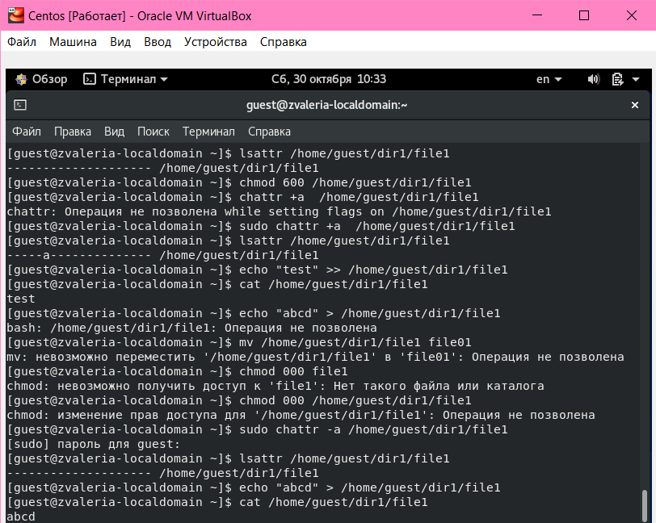
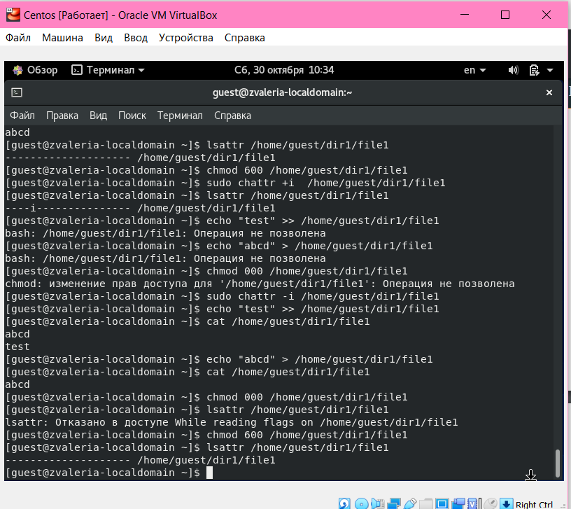

---
## Front matter
lang: ru-RU
title: Дискреционное разграничение прав в Linux. Расширенные атрибуты.
author: |
	 Жижченко Валерия Викторовна

institute: Российский Университет Дружбы Народов

## Formatting
mainfont: PT Serif
romanfont: PT Serif
sansfont: PT Sans
monofont: PT Mono
toc: false
slide_level: 2
theme: metropolis
header-includes: 
 - \metroset{progressbar=frametitle,sectionpage=progressbar,numbering=fraction}
 - '\makeatletter'
 - '\beamer@ignorenonframefalse'
 - '\makeatother'
aspectratio: 43
section-titles: true

---

# Цель лабораторной работы

Получить практические навыки работы в консоли с расширенными атрибутами файлов.

# Выполнение лабораторной работы

1. От имени пользователя guest определяем расширенные атрибуты файла
*/home/guest/dir1/file1*:

```
guest$ lasattr /home/guest/dir1/file1
```

2. Устанавливаем на файл *file1* права, разрещающие чтение и запись для владельца файла:

```
guest$ chmod 600 file1
```

3. Пробуем установить на файл */home/guest/dir1/file1* расширенный атрибут *a* от имени пользователя *guest*:

```
guest$ chattr +a /home/guest/dir1/file1
```

## Выполнение лабораторной работы

4. Пробуем установить расширенный атрибут *a* на файл */home/guest/dir1/file1* от имени суперпользователя:

```
guest$ su
root$ chattr +a /home/guest/dir1/file1
```

5. От пользователя *guest* проверяем правильность установления атрибута:

```
guest$ lsattr /home/guest/dir1/file1
```

6. Выполняем дозапись в файл *file1* слова "test". После этого выполняем чтение файла *file1*:

```
guest$ echo test >> /home/guest/dir1/file1
guest$ cat /home/guest/dir1/file1
```

## Выполнение лабораторной работы

7. Пробуем удалить файл *file1* либо стереть имеющуюся в нём информацию. Пробуем переименовать файл:

```
guest$ echo abcd > /home/guest/dir1/file1
guest$ mv /home/guest/dir1/file1 /home/guest/dir1/file1_1
```

8. Пробуем с помощью установить на файл *file1* права, запрещающие чтение и запись для владельца файла:

```
guest$ chmod 000 /home/guest/dir1/file1
```

9. Снимаем расширенный атрибут *a* с файла */home/guest/dirl/file1* от
имени суперпользователя. Повторяем операции, которые ранее не удавалось выполнить:

```
root$ chattr -a /home/guest/dir1/file1
```

## Выполнение лабораторной работы

{ #fig:001 width=70% }

## Выполнение лабораторной работы

10. Повторяем действия по шагам, заменив атрибут *a* атрибутом *i*:

{ #fig:002 width=70% }

# Вывод

В результате выполнения работы повысили свои навыки использования интерфейса командой строки (CLI), познакомились на примерах с тем, как используются основные и расширенные атрибуты при разграничении
доступа. Имели возможность связать теорию дискреционного разделения доступа (дискреционная политика безопасности) с её реализацией на практике в ОС Linux.
Опробовали действие на практике расширенных атрибутов "а" и "i".
