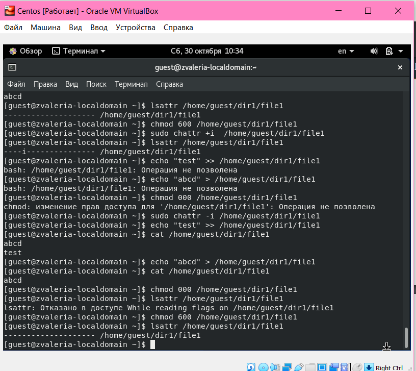

---
# Front matter
lang: ru-RU
title: "Отчёт по лабораторной работе №4"
subtitle: "Дискреционное разграничение прав в Linux. Расширенные атрибуты."
author: "Жижченко Валерия Викторовна"

# Formatting
toc-title: "Содержание"
toc: true # Table of contents
toc_depth: 2
lof: true # List of figures
fontsize: 12pt
linestretch: 1.5
papersize: a4paper
documentclass: scrreprt
polyglossia-lang: russian
polyglossia-otherlangs: english
mainfont: PT Serif
romanfont: PT Serif
sansfont: PT Sans
monofont: PT Mono
mainfontoptions: Ligatures=TeX
romanfontoptions: Ligatures=TeX
sansfontoptions: Ligatures=TeX,Scale=MatchLowercase
monofontoptions: Scale=MatchLowercase
indent: true
pdf-engine: lualatex
header-includes:
  - \linepenalty=10 # the penalty added to the badness of each line within a paragraph (no associated penalty node) Increasing the value makes tex try to have fewer lines in the paragraph.
  - \interlinepenalty=0 # value of the penalty (node) added after each line of a paragraph.
  - \hyphenpenalty=50 # the penalty for line breaking at an automatically inserted hyphen
  - \exhyphenpenalty=50 # the penalty for line breaking at an explicit hyphen
  - \binoppenalty=700 # the penalty for breaking a line at a binary operator
  - \relpenalty=500 # the penalty for breaking a line at a relation
  - \clubpenalty=150 # extra penalty for breaking after first line of a paragraph
  - \widowpenalty=150 # extra penalty for breaking before last line of a paragraph
  - \displaywidowpenalty=50 # extra penalty for breaking before last line before a display math
  - \brokenpenalty=100 # extra penalty for page breaking after a hyphenated line
  - \predisplaypenalty=10000 # penalty for breaking before a display
  - \postdisplaypenalty=0 # penalty for breaking after a display
  - \floatingpenalty = 20000 # penalty for splitting an insertion (can only be split footnote in standard LaTeX)
  - \raggedbottom # or \flushbottom
  - \usepackage{float} # keep figures where there are in the text
  - \floatplacement{figure}{H} # keep figures where there are in the text
---

# Цель работы

Получить практические навыки работы в консоли с расширенными атрибутами файлов.

# Выполнение лабораторной работы

1. От имени пользователя guest определяем расширенные атрибуты файла
*/home/guest/dir1/file1*:

```
guest$ lasattr /home/guest/dir1/file1
```

2. Устанавливаем на файл *file1* права, разрещающие чтение и запись для владельца файла:

```
guest$ chmod 600 file1
```

3. Пробуем установить на файл */home/guest/dir1/file1* расширенный атрибут *a* от имени пользователя *guest*:

```
guest$ chattr +a /home/guest/dir1/file1
```

4. Пробуем установить расширенный атрибут *a* на файл */home/guest/dir1/file1* от имени суперпользователя:

```
guest$ su
root$ chattr +a /home/guest/dir1/file1
```

5. От пользователя *guest* проверяем правильность установления атрибута:

```
guest$ lsattr /home/guest/dir1/file1
```

6. Выполняем дозапись в файл *file1* слова "test". После этого выполняем чтение файла *file1*:

```
guest$ echo test >> /home/guest/dir1/file1
guest$ cat /home/guest/dir1/file1
```

7. Пробуем удалить файл *file1* либо стереть имеющуюся в нём информацию. Пробуем переименовать файл:

```
guest$ echo abcd > /home/guest/dir1/file1
guest$ mv /home/guest/dir1/file1 /home/guest/dir1/file1_1
```

8. Пробуем с помощью установить на файл *file1* права, запрещающие чтение и запись для владельца файла:

```
guest$ chmod 000 /home/guest/dir1/file1
```

9. Снимаем расширенный атрибут *a* с файла */home/guest/dirl/file1* от
имени суперпользователя. Повторяем операции, которые ранее не удавалось выполнить:

```
root$ chattr -a /home/guest/dir1/file1
```

{ #fig:001 width=70% }

10. Повторяем действия по шагам, заменив атрибут *a* атрибутом *i*:

{ #fig:002 width=70% }

# Вывод

В результате выполнения работы повысили свои навыки использования интерфейса командой строки (CLI), познакомились на примерах с тем, как используются основные и расширенные атрибуты при разграничении
доступа. Имели возможность связать теорию дискреционного разделения доступа (дискреционная политика безопасности) с её реализацией на практике в ОС Linux. 
Опробовали действие на практике расширенных атрибутов "а" и "i".

