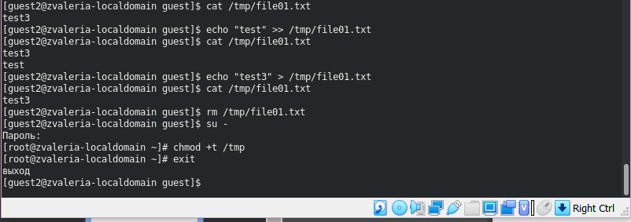

---
## Front matter
lang: ru-RU
title: Дискреционное разграничение прав в Linux. Исследование влияния дополнительных атрибутов 
author: |
	 Жижченко Валерия Викторовна

institute: Российский Университет Дружбы Народов

## Formatting
mainfont: PT Serif
romanfont: PT Serif
sansfont: PT Sans
monofont: PT Mono
toc: false
slide_level: 2
theme: metropolis
header-includes: 
 - \metroset{progressbar=frametitle,sectionpage=progressbar,numbering=fraction}
 - '\makeatletter'
 - '\beamer@ignorenonframefalse'
 - '\makeatother'
aspectratio: 43
section-titles: true

---

# Цель лабораторной работы

Изучение механизмов изменения идентификаторов, применения *SetUID-битов* и *Sticky-битов*.
Получение практических навыков работы в консоли с дополнительными атрибутами.
Рассмотрение работы механизма смены идентификатора процессов пользователей,
а также влияние бита *Sticky* на запись и удаление файлов.

# Выполнение лабораторной работы

## Создание программы

1. Входим в систему от имени пользователя *guest*.

2. Создаем программу *simpleid.c*.

3. Скомплилируем программу и убедимся, что файл программы создан:

```
$ gcc simpleid.c -o simpleid
```

4. Выполняем программу *simpleid*:

```
$ ./simpleid
```

## Создание программы

5. Выполняем системную программу *id* и сравниваем полученный результат с данными предыдущего пункта задания:

```
$ id
```

6. Усложняем программу, добавив вывод действительных идентификаторов. Получившуюся программу назовем *simpleid2.c*.

7. Скомпилируем и запустим *simpleid2.c*:

```
$ gcc simpleid2.c -o simpleid2
$ ./simpleid2
```

## Создание программы

8. От имени суперпользователя выполним следующие команды:

```
$ sudo chown root:guest /home/guest/simpleid2
$ sudo chmod u+s /home/guest/simpleid2
```

9. Выполним проверку правильности установки новых атрибутов и смены владельца файла *simpleid2*:

```
$ ls -l simpleid2
```

10. Запустим *simpleid2* и *id*:

```
$ ./simpleid2
$ id
```

## Создание программы

{ #fig:001 width=70% }

## Создание программы

11. Проделаем тоже самое относительно *SetGID-бита*.

{ #fig:002 width=70% }

## Создание программы

12. Создаем программу *readfile.c*.

13. Откомпилируем её:

```
$ gcc readfile.c -o readfile
```

14. Сменим владельца у файла *readfile.c* и изменим права так, чтобы только суперпользователь мог прочитать его.

15. Проверяем, что пользователь *guest* не может прочитать файл *readfile.c*.

## Создание программы

16. Сменим у программы *readfile* владельца и установим *SetUID-бит*.

17. Проверим, может ли программа *readfile* прочитать файл *readfile.c*:

## Создание программы

{ #fig:003 width=70% }

## Создание программы

18. Проверим, может ли программа *readfile* прочитать файл */etc/shadow*:

{ #fig:004 width=70% }

## Исследование *Sticky-бита*

1. Выясним, установлен ли атрибут *Sticky* на директории */tmp*:

```
guest$ ls -l / | grep tmp
```

2. От имени пользователя *guest* создаем файл *file01.txt* в директории */tmp* со словом *test*:

```
guest$ echo "test" > /tmp/file01.txt
```

3. Просмотрим атрибуты у только что созданного файла и разрешим чтение и запись для категории пользователей "все остальные":

```
guest$ ls -l /tmp/file01.txt
guest$ chmod o+rw /tmp/file01.txt
guest$ ls -l /tmp/file01.txt
```

## Исследование *Sticky-бита*

4. От пользователя *guest2* попробуем прочитать файл */tmp/file01.txt*:

```
guest2$ cat /tmp/file01.txt
```

5. От пользователя *guest2* попробуем дозаписать в файл */tmp/file01.txt* слово *test2*:

```
guest2$ echo "test2" > /tmp/file01.txt
```

6. Проверяем содержимое файла:

```
guest2$ cat /tmp/file01.txt
```

## Исследование *Sticky-бита*

7. От пользователя *guest2* попробуем записать в файл */tmp/file01.txt* слово *test3*, стерев при этом всю имеющуюся в файле информацию:

```
guest2$ echo "test3" > /tmp/file01.txt
```

8. Проверяем содержимое файла:

```
guest2$ cat /tmp/file01.txt
```

## Исследование *Sticky-бита*

9. От пользователя *guest2* попробуем удалить файл */tmp/file01.txt*:

```
guest2$ rm /tmp/fileOl.txt
```

10. От имени суперпользователя выполним команду, снимающую атрибут *t* с директории */tmp*:

```
guest2$ sudo chmod -t /tmp
```

## Исследование *Sticky-бита*

{ #fig:005 width=70% }

## Исследование *Sticky-бита*

12. От пользователя *guest2* проверяем, что атрибута *t* у директории */tmp* нет:

```
guest2$ ls -l / | grep tmp
```

13. Повторяем предыдущие шаги.

15. Повысим свои права до суперпользователя и вернем атрибут *t* на директорию */tmp*:

```
guest2$ sudo chmod +t /tmp
```

## Исследование *Sticky-бита*

{ #fig:006 width=70% }

# Вывод

Изучили механизмы изменения идентификаторов, применения SetUID- и Sticky-битов.
Получили практические навыки работы в консоли с дополнительными атрибутами.
Рассмотрели работу механизма смены идентификатора процессов пользователей,
а также влияние бита Sticky на запись и удаление файлов.
