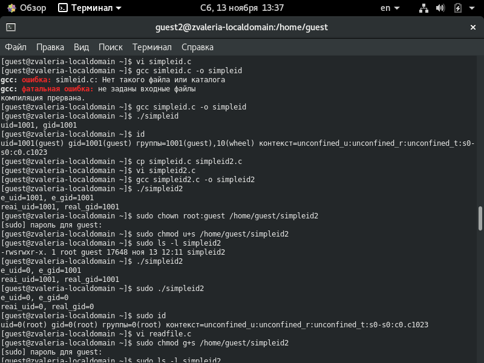
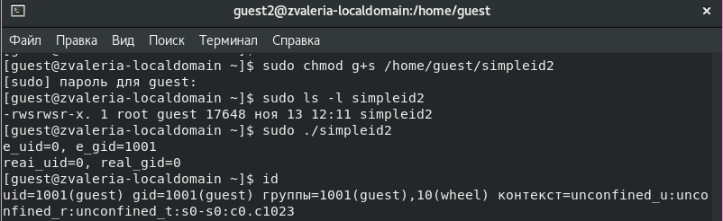
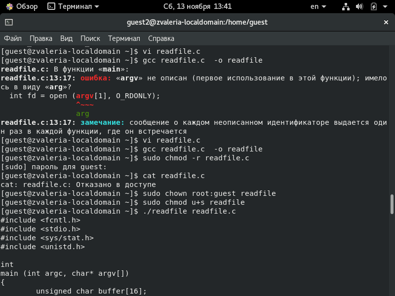
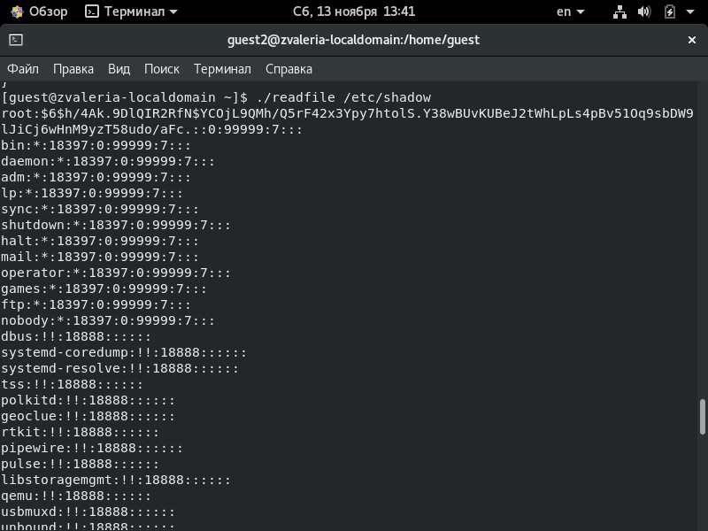
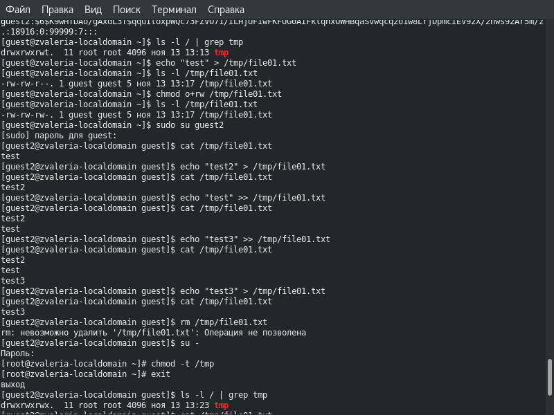
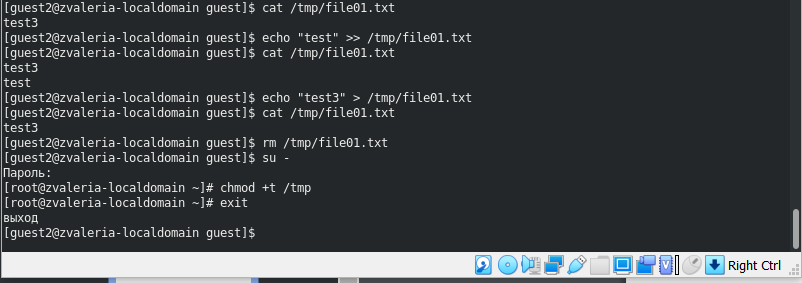

---
# Front matter
lang: ru-RU
title: "Отчёт по лабораторной работе №5"
subtitle: "Дискреционное разграничение прав в Linux. Исследование влияния дополнительных атрибутов"
author: "Жижченко Валерия Викторовна"

# Formatting
toc-title: "Содержание"
toc: true # Table of contents
toc_depth: 2
lof: true # List of figures
fontsize: 12pt
linestretch: 1.5
papersize: a4paper
documentclass: scrreprt
polyglossia-lang: russian
polyglossia-otherlangs: english
mainfont: PT Serif
romanfont: PT Serif
sansfont: PT Sans
monofont: PT Mono
mainfontoptions: Ligatures=TeX
romanfontoptions: Ligatures=TeX
sansfontoptions: Ligatures=TeX,Scale=MatchLowercase
monofontoptions: Scale=MatchLowercase
indent: true
pdf-engine: lualatex
header-includes:
  - \linepenalty=10 # the penalty added to the badness of each line within a paragraph (no associated penalty node) Increasing the value makes tex try to have fewer lines in the paragraph.
  - \interlinepenalty=0 # value of the penalty (node) added after each line of a paragraph.
  - \hyphenpenalty=50 # the penalty for line breaking at an automatically inserted hyphen
  - \exhyphenpenalty=50 # the penalty for line breaking at an explicit hyphen
  - \binoppenalty=700 # the penalty for breaking a line at a binary operator
  - \relpenalty=500 # the penalty for breaking a line at a relation
  - \clubpenalty=150 # extra penalty for breaking after first line of a paragraph
  - \widowpenalty=150 # extra penalty for breaking before last line of a paragraph
  - \displaywidowpenalty=50 # extra penalty for breaking before last line before a display math
  - \brokenpenalty=100 # extra penalty for page breaking after a hyphenated line
  - \predisplaypenalty=10000 # penalty for breaking before a display
  - \postdisplaypenalty=0 # penalty for breaking after a display
  - \floatingpenalty = 20000 # penalty for splitting an insertion (can only be split footnote in standard LaTeX)
  - \raggedbottom # or \flushbottom
  - \usepackage{float} # keep figures where there are in the text
  - \floatplacement{figure}{H} # keep figures where there are in the text
---

# Цель работы

Изучение механизмов изменения идентификаторов, применения *SetUID-битов* и *Sticky-битов*.
Получение практических навыков работы в консоли с дополнительными атрибутами.
Рассмотрение работы механизма смены идентификатора процессов пользователей,
а также влияние бита *Sticky* на запись и удаление файлов.

# Выполнение лабораторной работы

## Создание программы

1. Входим в систему от имени пользователя *guest*.

2. Создаем программу *simpleid.c*:

```C
#include <sys/types.h>
#include <unistd.h>
#include <stdio.h>

int main () {
  uid_t uid = geteuid();
  gid_t gid = getegid();

  printf ("uid=%d, gid=%d\n", uid, gid);

  return 0;
}
```

3. Скомплилируем программу и убедимся, что файл программы создан:

```
$ gcc simpleid.c -o simpleid
```

4. Выполняем программу *simpleid*:

```
$ ./simpleid
```

5. Выполняем системную программу *id* и сравниваем полученный результат с данными предыдущего пункта задания:

```
$ id
```

6. Усложняем программу, добавив вывод действительных идентификаторов. Получившуюся программу назовем *simpleid2.c*:

```C
#include <sys/types.h>
#include <unistd.h>
#include <stdio.h>

int main () {
  uid_t real_uid = getuid();
  uid_t e_uid = geteuid();
  gid_t real_gid = getgid();
  gid_t e_gid = getegid();

  printf ("e_uid=%d, e_gid=%d\n", e_uid, e_gid);
  printf ("real_uid=%d, real_gid=%d\n", real_uid, real_gid);

  return 0;
}
```

7. Скомпилируем и запустим *simpleid2.c*:

```
$ gcc simpleid2.c -o simpleid2
$ ./simpleid2
```

8. От имени суперпользователя выполним следующие команды:

```
$ sudo chown root:guest /home/guest/simpleid2
$ sudo chmod u+s /home/guest/simpleid2
```

9. Выполним проверку правильности установки новых атрибутов и смены владельца файла *simpleid2*:

```
$ ls -l simpleid2
```

10. Запустим *simpleid2* и *id*:

```
$ ./simpleid2
$ id
```

{ #fig:001 width=70% }

11. Проделаем тоже самое относительно *SetGID-бита*.

{ #fig:002 width=70% }

12. Создаем программу *readfile.c*:

```C
#include <fcntl.h>
#include <stdio.h>
#include <sys/stat.h>
#include <sys/types.h>
#include <unistd.h>

int main (int argc, char* argv[]) {
  unsigned char buffer[16];
  size_t bytes_read;
  int i;
  int fd = open(argv[1], O_RDONLY);

  do {
    bytes_read = read(fd, buffer, sizeof (buffer));

    for (i = 0; i < bytes_read; ++i) {
      printf("%c", buffer[i]);
    }
  } while (bytes_read == sizeof(buffer));

  close (fd);

  return 0;
}
```

13. Откомпилируем её:

```
$ gcc readfile.c -o readfile
```

14. Сменим владельца у файла *readfile.c* и изменим права так, чтобы только суперпользователь мог прочитать его.

15. Проверяем, что пользователь *guest* не может прочитать файл *readfile.c*.

16. Сменим у программы *readfile* владельца и установим *SetUID-бит*.

17. Проверим, может ли программа *readfile* прочитать файл *readfile.c*:

{ #fig:003 width=70% }

18. Проверим, может ли программа *readfile* прочитать файл */etc/shadow*:

{ #fig:004 width=70% }

## Исследование *Sticky-бита*

1. Выясним, установлен ли атрибут *Sticky* на директории */tmp*:

```
guest$ ls -l / | grep tmp
```

2. От имени пользователя *guest* создаем файл *file01.txt* в директории */tmp* со словом *test*:

```
guest$ echo "test" > /tmp/file01.txt
```

3. Просмотрим атрибуты у только что созданного файла и разрешим чтение и запись для категории пользователей "все остальные":

```
guest$ ls -l /tmp/file01.txt
guest$ chmod o+rw /tmp/file01.txt
guest$ ls -l /tmp/file01.txt
```

4. От пользователя *guest2* попробуем прочитать файл */tmp/file01.txt*:

```
guest2$ cat /tmp/file01.txt
```

5. От пользователя *guest2* попробуем дозаписать в файл */tmp/file01.txt* слово *test2*:

```
guest2$ echo "test2" > /tmp/file01.txt
```

6. Проверяем содержимое файла:

```
guest2$ cat /tmp/file01.txt
```

7. От пользователя *guest2* попробуем записать в файл */tmp/file01.txt* слово *test3*, стерев при этом всю имеющуюся в файле информацию:

```
guest2$ echo "test3" > /tmp/file01.txt
```

8. Проверяем содержимое файла:

```
guest2$ cat /tmp/file01.txt
```

9. От пользователя *guest2* попробуем удалить файл */tmp/file01.txt*:

```
guest2$ rm /tmp/fileOl.txt
```

10. От имени суперпользователя выполним команду, снимающую атрибут *t* с директории */tmp*:

```
guest2$ sudo chmod -t /tmp
```

{ #fig:005 width=70% }

12. От пользователя *guest2* проверяем, что атрибута *t* у директории */tmp* нет:

```
guest2$ ls -l / | grep tmp
```

13. Повторяем предыдущие шаги.

15. Повысим свои права до суперпользователя и вернем атрибут *t* на директорию */tmp*:

```
guest2$ sudo chmod +t /tmp
```

{ #fig:006 width=70% }

# Вывод

Изучили механизмы изменения идентификаторов, применения SetUID- и Sticky-битов.
Получили практические навыки работы в консоли с дополнительными атрибутами.
Рассмотрели работу механизма смены идентификатора процессов пользователей,
а также влияние бита Sticky на запись и удаление файлов.
