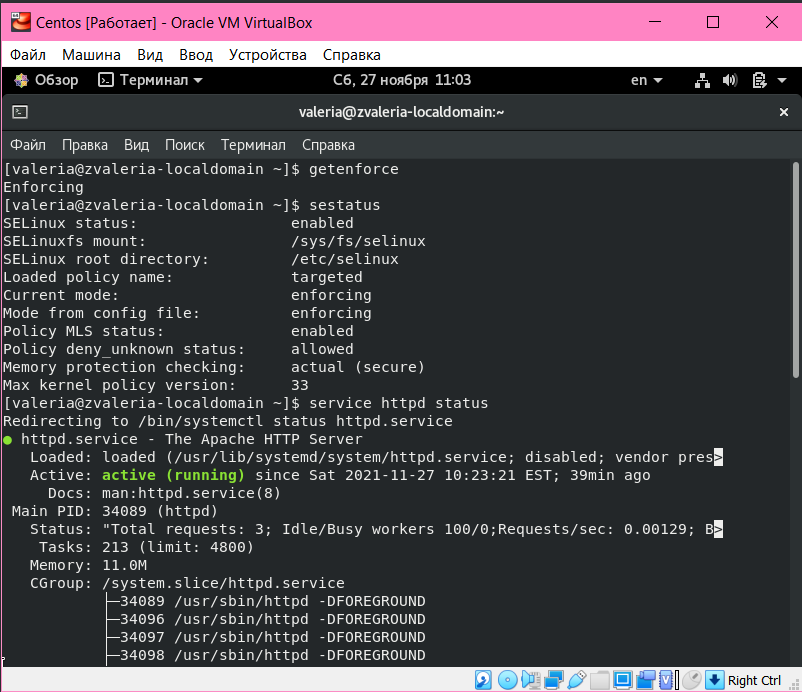
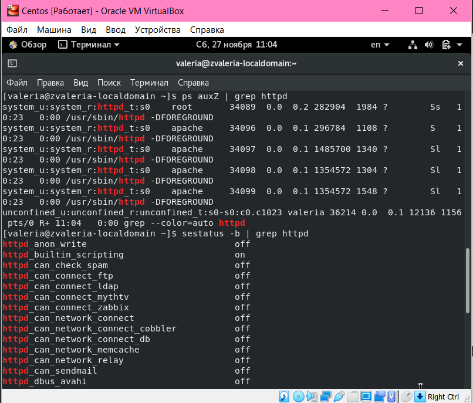
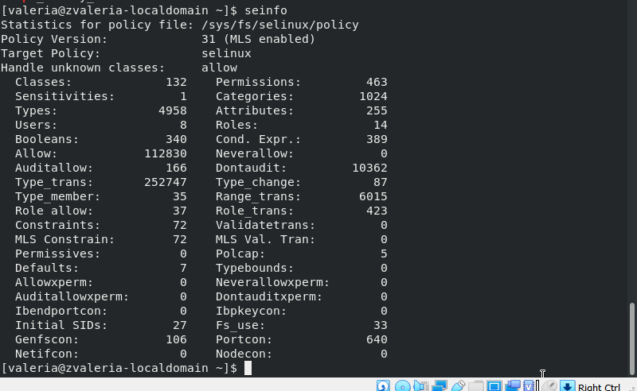
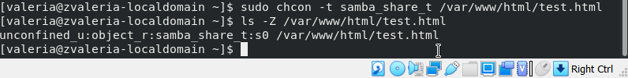

---
## Front matter
lang: ru-RU
title: Мандатное разграничение прав в Linux. 
author: |
	 Жижченко Валерия Вкторовна

institute: Российский Университет Дружбы Народов

## Formatting
mainfont: PT Serif
romanfont: PT Serif
sansfont: PT Sans
monofont: PT Mono
toc: false
slide_level: 2
theme: metropolis
header-includes: 
 - \metroset{progressbar=frametitle,sectionpage=progressbar,numbering=fraction}
 - '\makeatletter'
 - '\beamer@ignorenonframefalse'
 - '\makeatother'
aspectratio: 43
section-titles: true

---

# Цель лабораторной работы

Развить навыки администрирования ОС Linux. Получить первое практическое знакомство с технологией SELinux.

Проверить работу SELinux на практике совместно с веб-сервером Apache.

# Выполнение лабораторной работы

1. Вошли в систему с полученными учётными данными и убедились, что *SELinux* работает в режиме *enforcing* политики *targeted*:

```
$ sestatus
```

2. Убедились, что веб-сервер работает:

```
$ service httpd status
```

## Выполнение лабораторной работы

{ #fig:001 width=70% }

## Выполнение лабораторной работы

3. Нашли веб-сервер *Apache* в списке процессов, определили его контекст безопасности:

```
$ ps -eZ | grep httpd
```

4. Посмотрели текущее состояние переключателей *SELinux* для *Apache*:

```
$ sestatus -b | grep httpd
```

## Выполнение лабораторной работы

{ #fig:002 width=70% }

## Выполнение лабораторной работы

5. Посмотрели статистику по политике, также определили множество пользователей, ролей, типов:

```
$ seinfo
```

## Выполнение лабораторной работы

{ #fig:003 width=70% }

## Выполнение лабораторной работы

6. Определили тип файлов и поддиректорий, находящихся в директории */var/www*:

```
$ ls -lZ /var/www
```

7. Определили тип файлов, находящихся в директории */var/www/html*:

```
$ ls -lZ /var/www/html
```

## Выполнение лабораторной работы

8. Определили что создание файлов в директории */var/www/html* разрешено только пользователю *root*.

9. Создали от имени суперпользователя файл */var/www/html/test.html*.

10. Проверили контекст созданного файла:

```
$ ls -Z /var/www/html/test.html
```

## Выполнение лабораторной работы

{ #fig:004 width=70% }

## Выполнение лабораторной работы

11. Обратились к файлу через веб-сервер при помощи браузера:

{ #fig:005 width=70% }

## Выполнение лабораторной работы

12. Изучили справку *httpd_selinux* и выяснили, что для файлов httpd определены контексты *httpd_sys_content_t, httpd_sys_script_exec_t, httpd_sys_script_ro_t, httpd_sys_script_rw_t, httpd_sys_script_ra_t, httpd_unconfined_script_exec_t*.

Проверили контекст файла:

```
$ ls -Z /var/www/html/test.html
```

13. Измените контекст файла */var/www/html/test.html* с
*httpd_sys_content_t* на любой другой, к которому процесс *httpd* не
должен иметь доступа, например, на *samba_share_t*:

```
$ chcon -t samba_share_t /var/www/html/test.html
$ ls -Z /var/www/html/test.html
```

## Выполнение лабораторной работы

{ #fig:006 width=70% }

## Выполнение лабораторной работы

14. Попробовали получить доступ к файлу через веб-сервер:

{ #fig:007 width=70% }

## Выполнение лабораторной работы

15. Проанализировали почему файл не был отображён и посмотрели *log*-файлы веб-сервера *Apache*:

```
$ ls -l /var/www/html/test.html
$ tail /var/log/httpd/error_log
```

## Выполнение лабораторной работы

{ #fig:008 width=70% }

## Выполнение лабораторной работы

16. Изменили конфигурацию веб-сервера *Apache*, чтобы прослушивался порт 81.

17. Выполните перезапуск веб-сервера *Apache*. Так как все завершилось успешно, переходим в пункту 21.

21. Вернули контекст *httpd_sys_cоntent_t* к файлу */var/www/html/test.html* и попробовали получить доступ к файлу через веб-сервер:

```
$ chcon -t httpd_sys_content_t /var/www/html/test.html
```

## Выполнение лабораторной работы

{ #fig:009 width=70% }

## Выполнение лабораторной работы

{ #fig:010 width=70% }

## Выполнение лабораторной работы

22. Исправили обратно конфигурационный файл *apache*, вернув *Listen 80*.

23. Удалили файл */var/www/html/test.html*:

```
$ rm /var/www/html/test.html
```
## Выполнение лабораторной работы

{ #fig:011 width=70% }

# Вывод

Развили навыки администрирования ОС Linux. Получили первое практическое знакомство с технологией SELinux.
Проверили работу SELinx на практике совместно с веб-сервером Apache.
