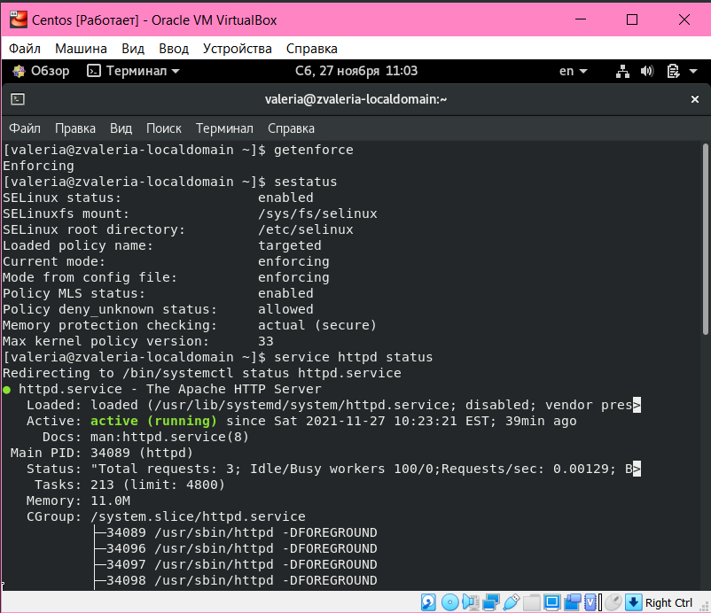
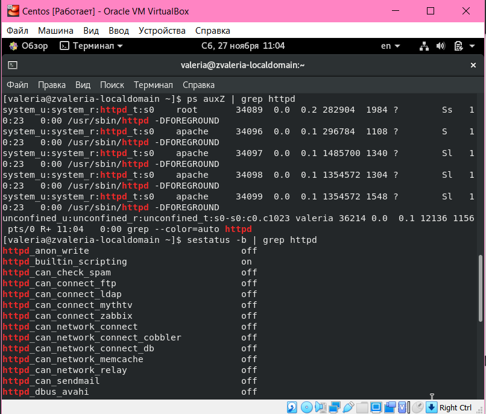
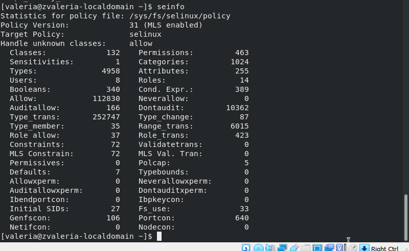
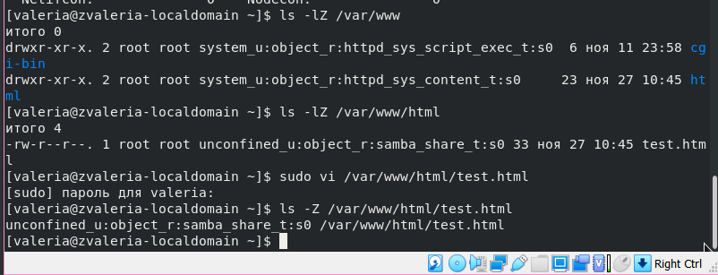
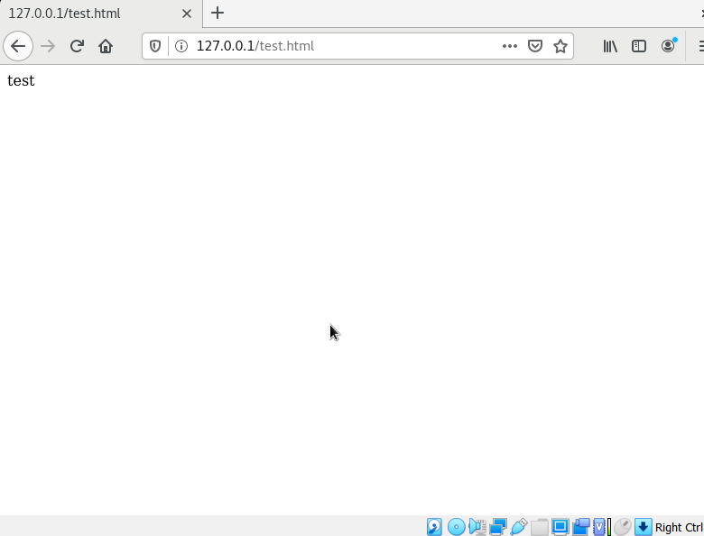
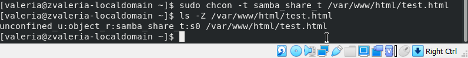
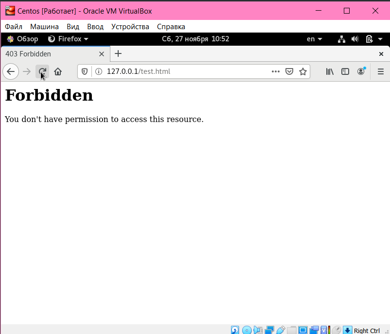
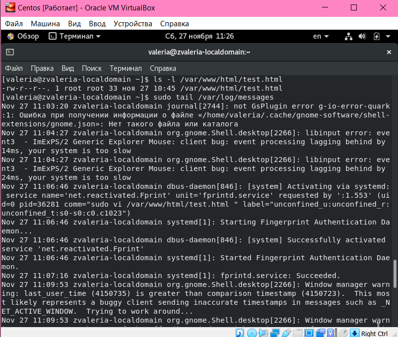
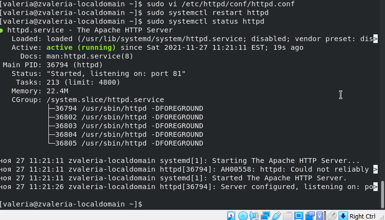
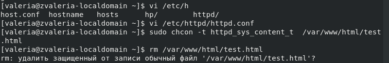

---
# Front matter
lang: ru-RU
title: "Отчёт по лабораторной работе №6"
subtitle: "Мандатное разграничение прав в Linux"
author: "Жижченко Валерия Викторовна"

# Formatting
toc-title: "Содержание"
toc: true # Table of contents
toc_depth: 2
lof: true # List of figures
fontsize: 12pt
linestretch: 1.5
papersize: a4paper
documentclass: scrreprt
polyglossia-lang: russian
polyglossia-otherlangs: english
mainfont: PT Serif
romanfont: PT Serif
sansfont: PT Sans
monofont: PT Mono
mainfontoptions: Ligatures=TeX
romanfontoptions: Ligatures=TeX
sansfontoptions: Ligatures=TeX,Scale=MatchLowercase
monofontoptions: Scale=MatchLowercase
indent: true
pdf-engine: lualatex
header-includes:
  - \linepenalty=10 # the penalty added to the badness of each line within a paragraph (no associated penalty node) Increasing the value makes tex try to have fewer lines in the paragraph.
  - \interlinepenalty=0 # value of the penalty (node) added after each line of a paragraph.
  - \hyphenpenalty=50 # the penalty for line breaking at an automatically inserted hyphen
  - \exhyphenpenalty=50 # the penalty for line breaking at an explicit hyphen
  - \binoppenalty=700 # the penalty for breaking a line at a binary operator
  - \relpenalty=500 # the penalty for breaking a line at a relation
  - \clubpenalty=150 # extra penalty for breaking after first line of a paragraph
  - \widowpenalty=150 # extra penalty for breaking before last line of a paragraph
  - \displaywidowpenalty=50 # extra penalty for breaking before last line before a display math
  - \brokenpenalty=100 # extra penalty for page breaking after a hyphenated line
  - \predisplaypenalty=10000 # penalty for breaking before a display
  - \postdisplaypenalty=0 # penalty for breaking after a display
  - \floatingpenalty = 20000 # penalty for splitting an insertion (can only be split footnote in standard LaTeX)
  - \raggedbottom # or \flushbottom
  - \usepackage{float} # keep figures where there are in the text
  - \floatplacement{figure}{H} # keep figures where there are in the text
---

# Цель работы

Развить навыки администрирования ОС Linux. Получить первое практическое знакомство с технологией SELinux.

Проверить работу SELinux на практике совместно с веб-сервером Apache.

# Выполнение лабораторной работы

1. Вошли в систему с полученными учётными данными и убедились, что *SELinux* работает в режиме *enforcing* политики *targeted*:

```
$ sestatus
```

2. Убедились, что веб-сервер работает:

```
$ service httpd status
```

{ #fig:001 width=70% }

3. Нашли веб-сервер *Apache* в списке процессов, определили его контекст безопасности:

```
$ ps -eZ | grep httpd
```

4. Посмотрели текущее состояние переключателей *SELinux* для *Apache*:

```
$ sestatus -b | grep httpd
```

{ #fig:002 width=70% }

5. Посмотрели статистику по политике, также определили множество пользователей, ролей, типов:

```
$ seinfo
```

{ #fig:003 width=70% }

6. Определили тип файлов и поддиректорий, находящихся в директории */var/www*:

```
$ ls -lZ /var/www
```

7. Определили тип файлов, находящихся в директории */var/www/html*:

```
$ ls -lZ /var/www/html
```

8. Определили что создание файлов в директории */var/www/html* разрешено только пользователю *root*.

9. Создали от имени суперпользователя файл */var/www/html/test.html*:

```html
<html>
  <body>test</body>
</html>
```

10. Проверили контекст созданного файла:

```
$ ls -Z /var/www/html/test.html
```

{ #fig:004 width=70% }

11. Обратились к файлу через веб-сервер при помощи браузера:

{ #fig:005 width=70% }

12. Изучили справку *httpd_selinux* и выяснили, что для файлов httpd определены контексты *httpd_sys_content_t, httpd_sys_script_exec_t, httpd_sys_script_ro_t, httpd_sys_script_rw_t, httpd_sys_script_ra_t, httpd_unconfined_script_exec_t*. 

Проверили контекст файла:

```
$ ls -Z /var/www/html/test.html
```

13. Измените контекст файла */var/www/html/test.html* с
*httpd_sys_content_t* на любой другой, к которому процесс *httpd* не
должен иметь доступа, например, на *samba_share_t*:

```
$ chcon -t samba_share_t /var/www/html/test.html
$ ls -Z /var/www/html/test.html
```

{ #fig:006 width=70% }

14. Попробовали получить доступ к файлу через веб-сервер:

{ #fig:007 width=70% }

15. Проанализировали почему файл не был отображён и посмотрели *log*-файлы веб-сервера *Apache*:

```
$ ls -l /var/www/html/test.html
$ tail /var/log/httpd/error_log
```

{ #fig:008 width=70% }

16. Изменили конфигурацию веб-сервера *Apache*, чтобы прослушивался порт 81.

17. Выполните перезапуск веб-сервера *Apache*. Так как все завершилось успешно, переходим в пункту 21.

21. Вернули контекст *httpd_sys_cоntent_t* к файлу */var/www/html/test.html* и попробовали получить доступ к файлу через веб-сервер:

```
$ chcon -t httpd_sys_content_t /var/www/html/test.html
```

{ #fig:009 width=70% }

{ #fig:010 width=70% }

22. Исправили обратно конфигурационный файл *apache*, вернув *Listen 80*.

23. Удалили файл */var/www/html/test.html*:

```
$ rm /var/www/html/test.html
```
{ #fig:011 width=70% }

# Вывод

Развили навыки администрирования ОС Linux. Получили первое практическое знакомство с технологией SELinux.
Проверили работу SELinx на практике совместно с веб-сервером Apache.
