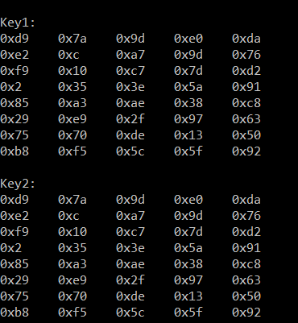

---
## Front matter
lang: ru-RU
title: Элементы криптографии. Однократное гаммирование 
author: |
	 Жижченко Валерия Викторовна

institute: Российский Университет Дружбы Народов

## Formatting
mainfont: PT Serif
romanfont: PT Serif
sansfont: PT Sans
monofont: PT Mono
toc: false
slide_level: 2
theme: metropolis
header-includes: 
 - \metroset{progressbar=frametitle,sectionpage=progressbar,numbering=fraction}
 - '\makeatletter'
 - '\beamer@ignorenonframefalse'
 - '\makeatother'
aspectratio: 43
section-titles: true

---

# Цель лабораторной работы

Освоить на практике применение режима однократного гаммирования

# Выполнение работы

Разработали приложение, позволяющее шифровать и дешифровать данные в режиме однократного гаммирования.
Приложение обладает следующим функционалом:

## Выполнение работы

1. Определяет вид шифротекста при изветсном ключе и известном открытом тексте.

{ #fig:001 width=70% }

## Выполнение работы

2. Определяет ключ, с помощью которого шифротекст может быть преобразованв некоторый фрагмент текста, представляющий собой один из возможных вариантов прочтения открытого тектса.

{ #fig:002 width=70% }

# Ответы на контрольные вопросы

1. Поясните смысл однократного гаммирования.

Гаммирование – выполнение операции XOR между элементами гаммы и элементами подлежащего сокрытию текста. Если в методе шифрования используется однократная вероятностная гамма (однократное гаммирование) той же длины, что и подлежащий сокрытию текст, то текст нельзя раскрыть. Даже при раскрытии части последовательности гаммы нельзя получить информацию о всём скрываемом тексте.

## Ответы на контрольные вопросы

2. Перечислите недостатки однократного гаммирования.

Абсолютная стойкость шифра доказана только для случая, когда однократно используемый ключ, длиной, равной длине исходного сообщения, является фрагментом истинно случайной двоичной последовательности с равномерным законом распределения.

## Ответы на контрольные вопросы

3. Перечислите преимущества однократного гаммирования.

Во-первых, такой способ симметричен, т.е. двойное прибавление одной и той же величины по модулю 2 восстанавливает исходное значение. Во-вторых, шифрование и расшифрование может быть выполнено одной и той же программой. Наконец, Криптоалгоритм не даёт никакой информации об открытом тексте: при известном зашифрованном сообщении C все различные ключевые последовательности K возможны и равновероятны, а значит, возможны и любые сообщения P.

## Ответы на контрольные вопросы

4. Почему длина открытого текста должна совпадать с длиной ключа?

Если ключ короче текста, то операция XOR будет применена не ко всем элементам и конец сообщения будет не закодирован. Если ключ будет длиннее, то появится неоднозначность декодирования.

## Ответы на контрольные вопросы

5. Какая операция используется в режиме однократного гаммирования, назовите её особенности?

Наложение гаммы по сути представляет собой выполнение побитовой операции сложения по модулю 2, т.е. мы должны сложить каждый элемент гаммы с соответствующим элементом ключа. Данная операция является симметричной, так как прибавление одной и той же величины по модулю 2 восстанавливает исходное значение.

## Ответы на контрольные вопросы

6. Как по открытому тексту и ключу получить шифротекст?

В таком случае задача сводится к правилу:

$C_i = P_i\oplus K_i$

т.е. мы поэлементно получаем символы зашифрованного сообщения, применяя операцию исключающего или к соответствующим элементам ключа и открытого текста.

## Ответы на контрольные вопросы

7. Как по открытому тексту и шифротексту получить ключ?

Подобная задача решается путем применения операции исключающего или к последовательностям символов зашифрованного и открытого сообщений:

$K_i = P_i\oplus C_i$.

## Ответы на контрольные вопросы

8. В чем заключаются необходимые и достаточные условия абсолютной стойкости шифра?

Необходимые и достаточные условия абсолютной стойкости шифра:

* полная случайность ключа;
* равенство длин ключа и открытого текста;
* однократное использование ключа.

# Вывод

Освоили на практике применение режима однократного гаммирования
