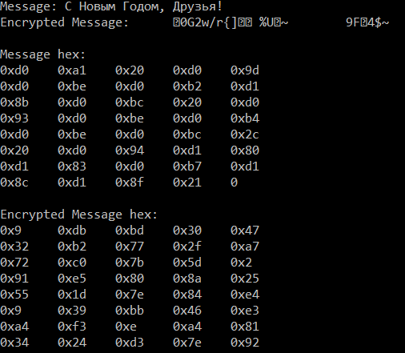
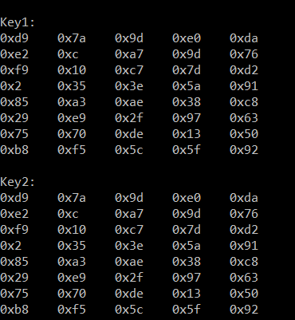

---
# Front matter
lang: ru-RU
title: "Отчёт по лабораторной работе №7"
subtitle: "Элементы криптографии. Однократное гаммирование"
author: "Жижченко Валерия Викторовна"

# Formatting
toc-title: "Содержание"
toc: true # Table of contents
toc_depth: 2
lof: true # List of figures
fontsize: 12pt
linestretch: 1.5
papersize: a4paper
documentclass: scrreprt
polyglossia-lang: russian
polyglossia-otherlangs: english
mainfont: PT Serif
romanfont: PT Serif
sansfont: PT Sans
monofont: PT Mono
mainfontoptions: Ligatures=TeX
romanfontoptions: Ligatures=TeX
sansfontoptions: Ligatures=TeX,Scale=MatchLowercase
monofontoptions: Scale=MatchLowercase
indent: true
pdf-engine: lualatex
header-includes:
  - \linepenalty=10 # the penalty added to the badness of each line within a paragraph (no associated penalty node) Increasing the value makes tex try to have fewer lines in the paragraph.
  - \interlinepenalty=0 # value of the penalty (node) added after each line of a paragraph.
  - \hyphenpenalty=50 # the penalty for line breaking at an automatically inserted hyphen
  - \exhyphenpenalty=50 # the penalty for line breaking at an explicit hyphen
  - \binoppenalty=700 # the penalty for breaking a line at a binary operator
  - \relpenalty=500 # the penalty for breaking a line at a relation
  - \clubpenalty=150 # extra penalty for breaking after first line of a paragraph
  - \widowpenalty=150 # extra penalty for breaking before last line of a paragraph
  - \displaywidowpenalty=50 # extra penalty for breaking before last line before a display math
  - \brokenpenalty=100 # extra penalty for page breaking after a hyphenated line
  - \predisplaypenalty=10000 # penalty for breaking before a display
  - \postdisplaypenalty=0 # penalty for breaking after a display
  - \floatingpenalty = 20000 # penalty for splitting an insertion (can only be split footnote in standard LaTeX)
  - \raggedbottom # or \flushbottom
  - \usepackage{float} # keep figures where there are in the text
  - \floatplacement{figure}{H} # keep figures where there are in the text
---

# Цель работы

Освоить на практике применение режима однократного гаммирования

# Выполнение работы

Разработали приложение, позволяющее шифровать и дешифровать данные в режиме однократного гаммирования.
Приложение обладает следующим функционалом:

```C++
#include <iostream>
#include <cstdlib>
#include <ctime>
#include <vector>

using namespace std;

vector<unsigned char> generateKey(size_t len);
vector<unsigned char> arrXOR(vector<unsigned char> msg1, vector<unsigned char> msg2);

int main() {
  unsigned char str[] = {"С Новым Годом, Друзья!"};
  vector<unsigned char> message(str, str + sizeof(str));

  auto key = generateKey(message.size());
  auto encrMessage = arrXOR(message, key);
  auto key2 = arrXOR(message, encrMessage);

  cout << "Message: ";

  for (auto i: message) {
    cout << i;
  }

  cout << endl << "Encrypted Message: ";

  for (auto i: encrMessage) {
    cout << i;
  }

  int count = 0;

  cout << endl << endl << "Message hex:" << endl;

  for (auto i: message) {
    printf("%#x\t", i);

    if (count++ >= 4) {
      count = 0;
      cout << endl;
    }
  }

  count = 0;

  cout << endl << "Encrypted Message hex:" << endl;

  for (auto i: encrMessage) {
    printf("%#x\t", i);

    if (count++ >= 4) {
      count = 0;
      cout << endl;
    }
  }

  count = 0;

  cout << endl << endl << "Key1:" << endl;

  for (auto i: key) {
    printf("%#x\t", i);

    if (count++ >= 4) {
      count = 0;
      cout << endl;
    }
  }

  count = 0;

  cout << endl << "Key2:" << endl;

  for (auto i: key) {
    printf("%#x\t", i);

    if (count++ >= 4) {
      count = 0;
      cout << endl;
    }
  }

  return 0;
}

vector<unsigned char> generateKey(size_t len) {
  vector<unsigned char> out;

  srand(time(nullptr));

  for (int i = 0; i < len; i++) {
    out.push_back(rand() % (1 << 8 * sizeof(unsigned char)));
  }

  return out;
}

vector<unsigned char> arrXOR(vector<unsigned char> msg1, vector<unsigned char> msg2) {
  vector<unsigned char> out;

  for (int i = 0; i < msg1.size(); i++) {
    out.push_back(msg1[i] ^ msg2[i]);
  }

  return out;
}
```

1. Определяет вид шифротекста при изветсном ключе и известном открытом тексте.

{ #fig:001 width=70% }

2. Определяет ключ, с помощью которого шифротекст может быть преобразованв некоторый фрагмент текста, представляющий собой один из возможных вариантов прочтения открытого тектса.

{ #fig:002 width=70% }

# Ответы на контрольные вопросы

1. Поясните смысл однократного гаммирования.

Гаммирование – выполнение операции XOR между элементами гаммы и элементами подлежащего сокрытию текста. Если в методе шифрования используется однократная вероятностная гамма (однократное гаммирование) той же длины, что и подлежащий сокрытию текст, то текст нельзя раскрыть. Даже при раскрытии части последовательности гаммы нельзя получить информацию о всём скрываемом тексте.

2. Перечислите недостатки однократного гаммирования.

Абсолютная стойкость шифра доказана только для случая, когда однократно используемый ключ, длиной, равной длине исходного сообщения, является фрагментом истинно случайной двоичной последовательности с равномерным законом распределения.

3. Перечислите преимущества однократного гаммирования.

Во-первых, такой способ симметричен, т.е. двойное прибавление одной и той же величины по модулю 2 восстанавливает исходное значение. Во-вторых, шифрование и расшифрование может быть выполнено одной и той же программой. Наконец, Криптоалгоритм не даёт никакой информации об открытом тексте: при известном зашифрованном сообщении C все различные ключевые последовательности K возможны и равновероятны, а значит, возможны и любые сообщения P.

4. Почему длина открытого текста должна совпадать с длиной ключа?

Если ключ короче текста, то операция XOR будет применена не ко всем элементам и конец сообщения будет не закодирован. Если ключ будет длиннее, то появится неоднозначность декодирования.

5. Какая операция используется в режиме однократного гаммирования, назовите её особенности?

Наложение гаммы по сути представляет собой выполнение побитовой операции сложения по модулю 2, т.е. мы должны сложить каждый элемент гаммы с соответствующим элементом ключа. Данная операция является симметричной, так как прибавление одной и той же величины по модулю 2 восстанавливает исходное значение.

6. Как по открытому тексту и ключу получить шифротекст?

В таком случае задача сводится к правилу:

$C_i = P_i\oplus K_i$

т.е. мы поэлементно получаем символы зашифрованного сообщения, применяя операцию исключающего или к соответствующим элементам ключа и открытого текста.

7. Как по открытому тексту и шифротексту получить ключ?

Подобная задача решается путем применения операции исключающего или к последовательностям символов зашифрованного и открытого сообщений:

$K_i = P_i\oplus C_i$.

8. В чем заключаются необходимые и достаточные условия абсолютной стойкости шифра?

Необходимые и достаточные условия абсолютной стойкости шифра:

* полная случайность ключа;
* равенство длин ключа и открытого текста;
* однократное использование ключа.

# Вывод

Освоили на практике применение режима однократного гаммирования
